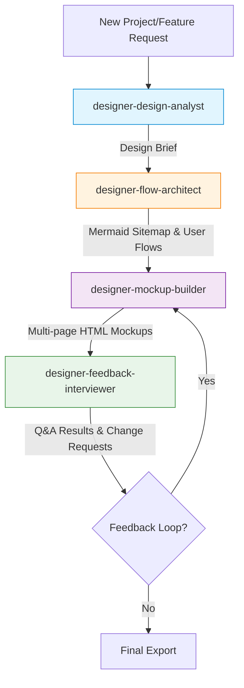

# UI/UX Designer Workflow Guide

This document defines the agentic workflow system for transforming design requirements into interactive HTML mockups. This system orchestrates four specialized subagents to guide the repository from initial requirements through final interactive mockups with built-in feedback loops.

---

## The Four Design Agents

| Agent | Role | Assigned Skill | Input | Output |
| :--- | :--- | :--- | :--- | :--- |
| **designer-design-analyst** | Understand requirements | [designer-design-analysis](skills/designer-design-analysis/SKILL.md) | Project description | Design brief with personas, features, constraints |
| **designer-flow-architect** | Create visual structure | [designer-user-flows](skills/designer-user-flows/SKILL.md) | Design brief | Mermaid sitemap & user flow diagrams |
| **designer-mockup-builder** | Build HTML prototypes | [designer-mockups](skills/designer-mockups/SKILL.md) | Mermaid diagrams | Aligned HTML mockups with theme selection |
| **designer-feedback-interviewer** | Gather user feedback | [designer-feedback](skills/designer-feedback/SKILL.md) | HTML mockups | Structured Q&A + change requests |

---

## Workflow Diagram



---

## Output Structure

All generated design deliverables are saved to the standalone plans folder at `.agents/plans/designer-output/`:

```
.agents/plans/designer-output/
├── briefs/              # Design briefs from designer-design-analyst
│   └── [project]-brief.md
├── sitemaps/            # Mermaid diagrams from designer-flow-architect
│   ├── [project]-sitemap.md
│   └── [project]-flows.md
├── mockups/             # HTML/CSS mockups from designer-mockup-builder
│   ├── index.html       # Home/Dashboard page
│   ├── theme.js         # Local theme switcher script
│   └── ...
└── feedback-reports/    # Feedback from designer-feedback-interviewer
    └── [project]-feedback.md
```

---

## Approval Checkpoints

Each agent must request explicit user approval before proceeding to the next step:

1.  **Checkpoint 1 (After Design Brief):** Present the design brief to the user, wait for confirmation, then proceed to `designer-flow-architect`.
2.  **Checkpoint 2 (After Mermaid Diagrams):** Present the sitemap and user flow diagrams, wait for confirmation, then proceed to `designer-mockup-builder`.
3.  **Checkpoint 3 (After HTML Mockups):** Ask the user to review the mockups, open them in the browser, and obtain approval to proceed to the `designer-feedback-interviewer` session.
4.  **Checkpoint 4 (After Feedback Session):** Present the prioritized change request report, ask the user whether to apply changes (returning to `designer-mockup-builder`) or finalize the deliverables.

---

## How to Trigger the Design Workflow

To run a design workflow, prompt the agent:
> *"Run the full UI/UX design workflow starting with designer-design-analyst on: [project description]"*
