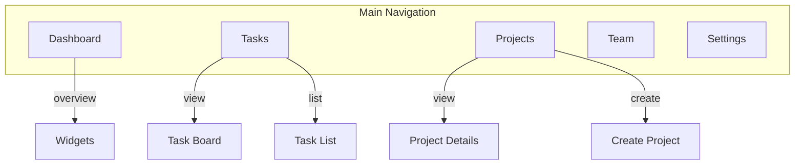

# Sitemap: [Project Name]

## Mermaid Diagram

## Page Descriptions

### /dashboard
**Purpose:** Overview and quick actions
**Components:**
- Welcome header with user name
- Recent activity feed
- Quick stats widgets
- Recent tasks list

### /tasks
**Purpose:** Task management interface
**Components:**
- Page header with "Add Task" button
- View toggle (List | Kanban)
- Task cards/rows with actions
- Filter/sort controls

### /projects
**Purpose:** Project listing and management
**Components:**
- Project cards grid
- "New Project" button
- Search and filter bar
- Pagination controls

## Notes
- Global navigation should include all main pages
- User can access settings from anywhere via user menu
- Tasks page is the primary workflow entry point
