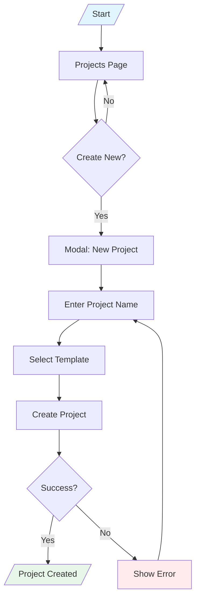
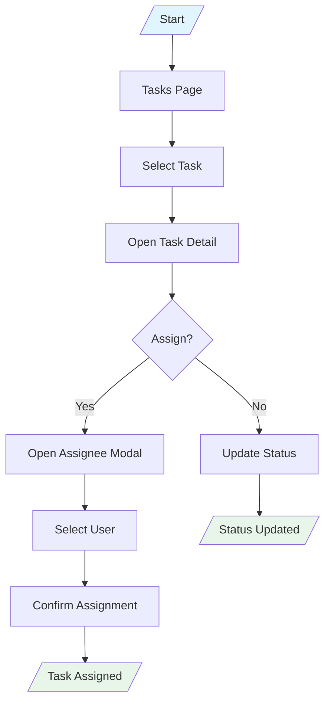

# User Flows: [Project Name]

## Create Project Flow

```mermaid
flowchart TD
    A[/Start/] --> B[Projects Page]
    B --> C{Create New?}
    C -->|Yes| D[Modal: New Project]
    C -->|No| B
    D --> E[Enter Project Name]
    E --> F[Select Template]
    F --> G[Create Project]
    G --> H{Success?}
    H -->|Yes| I[/Project Created/]
    H -->|No| J[Show Error]
    J --> E
    
    style A fill:#e1f5fe
    style I fill:#e8f5e9
    style J fill:#ffebee
```

## Task Assignment Flow

```mermaid
flowchart TD
    A[/Start/] --> B[Tasks Page]
    B --> C[Select Task]
    C --> D[Open Task Detail]
    D --> E{Assign?}
    E -->|Yes| F[Open Assignee Modal]
    E -->|No| G[Update Status]
    F --> H[Select User]
    H --> I[Confirm Assignment]
    I --> J[/Task Assigned/]
    G --> K[/Status Updated/]
    
    style A fill:#e1f5fe
    style J fill:#e8f5e9
    style K fill:#e8f5e9
```

## Key Flows Documented
1. Create Project
2. Assign Task
3. Update Task Status
4. Invite Team Member
